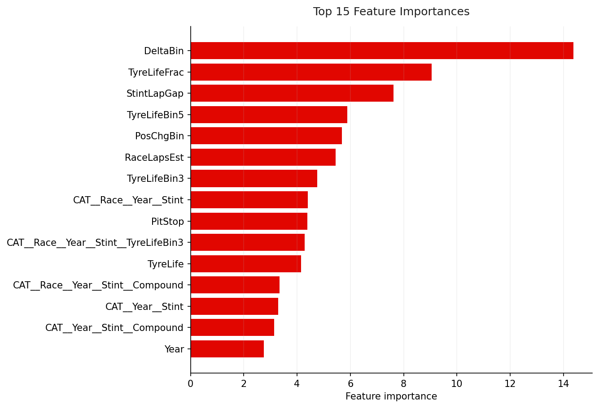
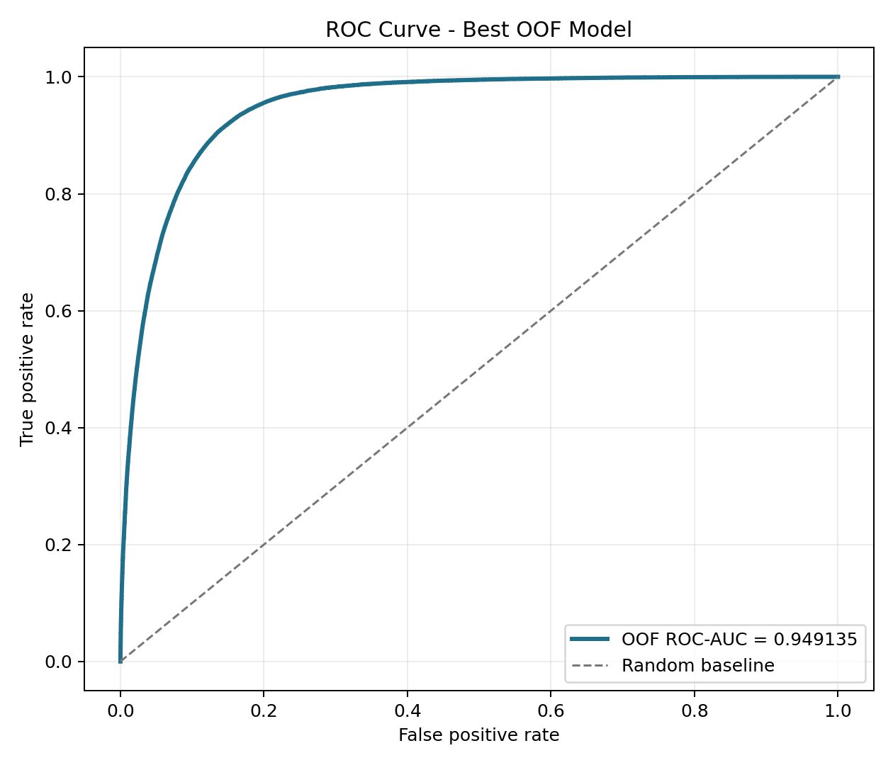
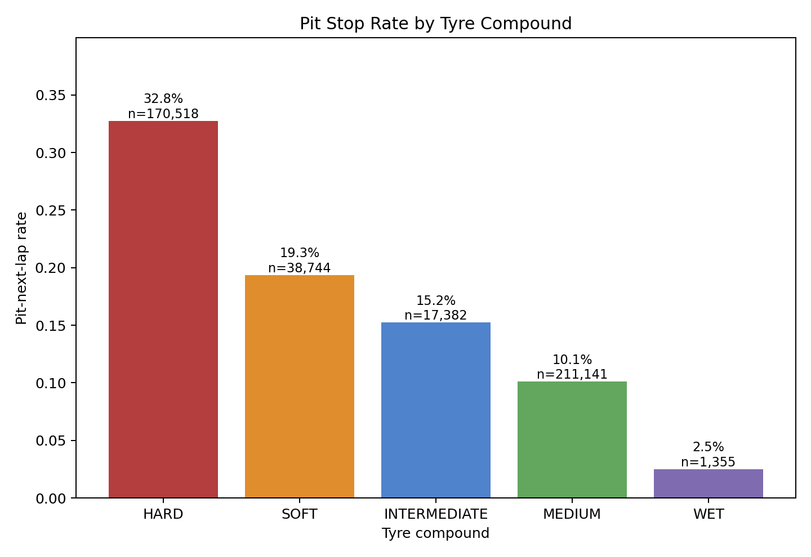
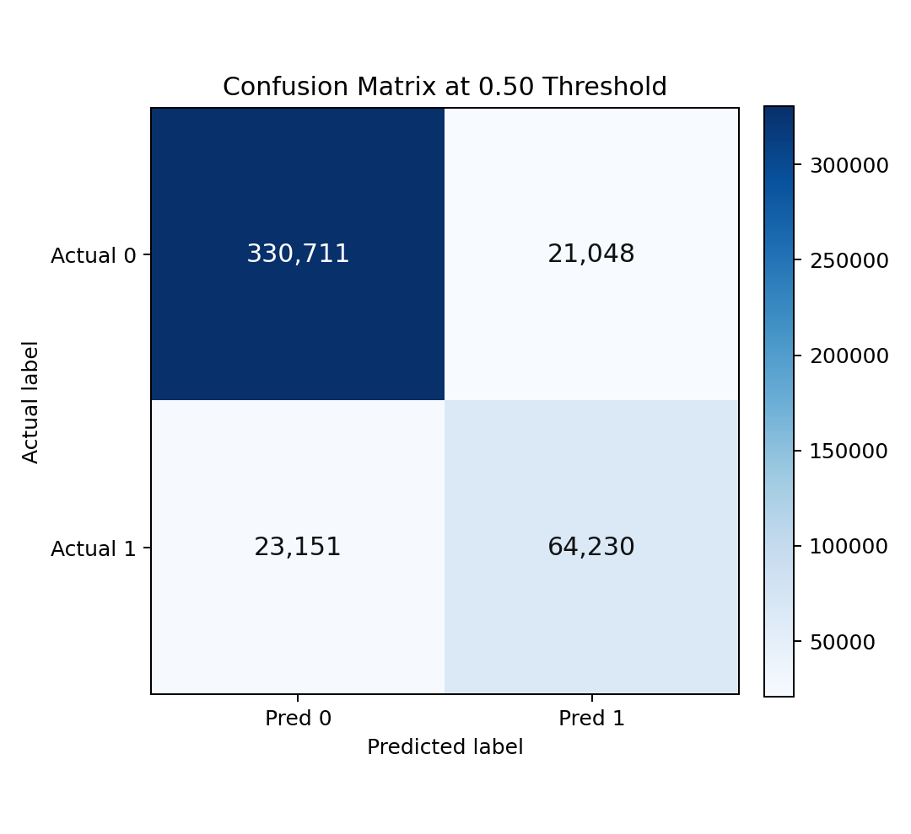

# F1 Pit Stop Prediction

Predicting whether a Formula 1 car is likely to pit on the next lap using race timing, tyre, stint, and track-position data.
- **Competition rank:** 1,406 / 3,022 — top 46% (Kaggle Playground Series S6E5)

## Results

| Metric | Value |
|--------|-------|
| Competition | Kaggle Playground Series S6E5 — F1 Pit Stop Prediction |
| Final Rank | 1,406 / 3,022 (top 46%) |
| Best AUC | 0.9491 |
| Best Model | Phase 4.5 hard-region specialist ensemble |
| Dataset Size | 439,140 training rows × 16 features |

Metric source: `experiments/20260519_150804_phase45_hard/summary.json`

## Key Findings

- **Tyre compound is a major signal.** HARD tyres had a `32.8%` pit-next-lap rate, compared with `10.1%` for MEDIUM tyres and `2.5%` for WET tyres.
- **Race stint matters.** The second stint was the most pit-heavy section in the training data, with a `39.1%` pit-next-lap rate, while the first stint was only `6.0%`.
- **Pit decisions are driven by race state, not one variable alone.** The strongest model features included tyre-life progress, lap-to-stint gaps, lap-time delta bins, and race/year/stint interaction patterns.

## Visuals

### Feature Importance



### ROC Curve



### Tyre Compound vs Pit Stop Rate



### Confusion Matrix



## Methodology

The project treats pit-stop prediction as a ranking problem: each row represents a race state, and the model estimates how likely that state is to lead to a pit stop on the next lap.

The pipeline builds race-aware features from tyre life, stint progress, lap timing, position changes, compound choice, and race/session groupings. It then compares several model families, including gradient boosting, CatBoost, table-based encoders, local-neighborhood features, specialist models for difficult regions, and rank-based ensembles.

The best saved system came from a hard-region specialist ensemble. It started with a strong Phase 3 race-state model, then applied local corrections only in uncertain regions where the base model and specialist models disagreed.

## How to Run

Place the Kaggle competition files in `data/raw/`:

```text
data/raw/train.csv
data/raw/test.csv
data/raw/sample_submission.csv
```

Install dependencies:

```powershell
pip install -r requirements.txt
```

Run the core pipeline:

```powershell
python src/diagnostics.py
python src/features.py
python src/train.py --cv stratified --models lgbm,xgb,hist_gbdt --tag baseline
python src/ensemble.py --experiments <experiment_id> --tag final
```

Optional advanced experiments are available in:

```text
src/catboost_phase2.py
src/phase3_neighborhood.py
src/phase3_specialists.py
src/phase45_hard_regions.py
src/validation_realism.py
```

## Skills Demonstrated

- Python
- Pandas
- LightGBM/XGBoost
- Feature Engineering
- Ensemble Methods
- Spatiotemporal Analysis
